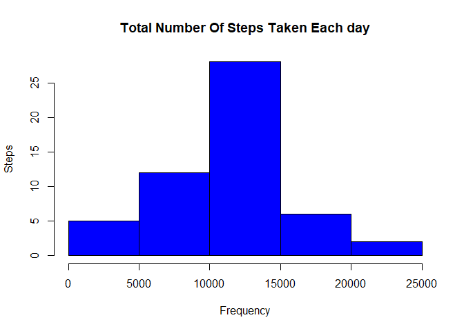

R Markdown
----------

Loading the data

    library(ggplot2)
    library(dplyr)

    ## 
    ## Attaching package: 'dplyr'

    ## The following objects are masked from 'package:stats':
    ## 
    ##     filter, lag

    ## The following objects are masked from 'package:base':
    ## 
    ##     intersect, setdiff, setequal, union

    library(knitr)
    library(chron)

    if(!file.exists("getdata-projectfiles-UCI HAR Dataset.zip")) {
      temp <- tempfile()
      download.file("http://d396qusza40orc.cloudfront.net/repdata%2Fdata%2Factivity.zip",temp)
      unzip(temp)
      unlink(temp)
    }

    data <- read.csv("activity.csv")

    a<-read.csv("activity.csv")
    head(a)

    ##   steps       date interval
    ## 1    NA 2012-10-01        0
    ## 2    NA 2012-10-01        5
    ## 3    NA 2012-10-01       10
    ## 4    NA 2012-10-01       15
    ## 5    NA 2012-10-01       20
    ## 6    NA 2012-10-01       25

\#\#Histogram of the total number of steps taken each day

    #Aggregating steps over date
    aggsteps<- aggregate(steps ~ date, a, FUN=sum)
     
    #Aggregated Data (all steps added for a particular date)
    head(aggsteps)

    ##         date steps
    ## 1 2012-10-02   126
    ## 2 2012-10-03 11352
    ## 3 2012-10-04 12116
    ## 4 2012-10-05 13294
    ## 5 2012-10-06 15420
    ## 6 2012-10-07 11015

    #Plotting the histogram using hist()
    hist(aggsteps$steps, 
         col="blue", 
         xlab = "Frequency", 
         ylab = "Steps",
         main = "Total Number Of Steps Taken Each day")

\#Mean and median number of steps taken each day

    amean <- mean(aggsteps$steps)
    amedian <- median(aggsteps$steps)
    amean

    ## [1] 10766.19

    amedian

    ## [1] 10765

\#What is the average daily activity pattern? \#\#Make a time series
plot (i.e. type = “l”) of the 5-minute interval (x-axis) and the average
number of steps taken, averaged across all days (y-axis)

\#Aggregating(summation) of steps over time interval

    agginterval <- aggregate(steps ~ interval, a, FUN=sum)

\#Plotting the line graph using plot() for Total Steps vs 5-Minute
Interval

    plot(agginterval$interval, agginterval$steps, 
         type = "l", lwd = 2,
         xlab = "Interval", 
         ylab = "Total Steps",
         main = "Total Steps vs. 5-Minute Interval")

    #Which 5-minute interval, on average across all the days in the dataset, contains the maximum number of steps?
     
    # Getting the 5 min interval with maximum of steps 
    filter(agginterval, steps==max(steps))

\#Imputing missing values \#\#Note that there are a number of
days/intervals where there are missing values (coded as NA). The
presence of missing days may introduce bias into some calculations or
summaries of the data. Calculate and report the total number of missing
values in the dataset (i.e. the total number of rows with NAs) \# TRUE
represents the total number of NA values

    table(is.na(a))

    ## 
    ## FALSE  TRUE 
    ## 50400  2304

\#Devise a strategy for filling in all of the missing values in the
dataset. The strategy does not need to be sophisticated. For example,
you could use the mean/median for that day, or the mean for that
5-minute interval, etc.

    #In the original data set aggregating (mean) steps over 5-minute interval
    meaninterval<- aggregate(steps ~ interval, a, FUN=mean)
     
    #Merging the mean of total steps for a date with the original data set
    anew <- merge(x=a, y=meaninterval, by="interval")
     
    #Replacing the NA values with the mean for that 5-minute interval
    anew$steps <- ifelse(is.na(anew$steps.x), anew$steps.y, anew$steps.x)
     
    #Merged dataset which will be subsetted in the next step by removing not required columns
    head(anew)

    ##   interval steps.x       date  steps.y    steps
    ## 1        0      NA 2012-10-01 1.716981 1.716981
    ## 2        0       0 2012-11-23 1.716981 0.000000
    ## 3        0       0 2012-10-28 1.716981 0.000000
    ## 4        0       0 2012-11-06 1.716981 0.000000
    ## 5        0       0 2012-11-24 1.716981 0.000000
    ## 6        0       0 2012-11-15 1.716981 0.000000

\#Create a new dataset that is equal to the original dataset but with
the missing data filled in. \#Fetching only the required columns (steps,
date, interval) and storing in the new data set.

    anew <- select(anew, steps, date, interval)
     
    #New dataset with NA imputed by mean for that 5-minute interval
    head(anew)

    ##      steps       date interval
    ## 1 1.716981 2012-10-01        0
    ## 2 0.000000 2012-11-23        0
    ## 3 0.000000 2012-10-28        0
    ## 4 0.000000 2012-11-06        0
    ## 5 0.000000 2012-11-24        0
    ## 6 0.000000 2012-11-15        0

\#Make a histogram of the total number of steps taken each day and
Calculate and report the mean and median total number of steps taken per
day. Do these values differ from the estimates from the first part of
the assignment? What is the impact of imputing missing data on the
estimates of the total daily number of steps?

            #Aggregating(summation) of steps over date
            aggsteps_new<- aggregate(steps ~ date, anew, FUN=sum)
     
    #Setting up the pannel for one row and two columns
    par(mfrow=c(1,2))
     
    #Histogram after imputing NA values with mean of 5-min interval
    hist(aggsteps_new$steps, 
         col="green",
         xlab = "Steps", 
         ylab = "Frequency",
         ylim = c(0,35),
         main = "Total Number Of Steps Taken Each day \n(After imputing NA values with \n mean of 5-min interval)",
         cex.main = 0.7)
     
    #Histogram with the orginal dataset
    hist(aggsteps$steps, 
         col="red", 
         xlab = "Steps", 
         ylab = "Frequency",
         ylim = c(0,35),
         main = "Total Number Of Steps Taken Each day \n(Orginal Dataset)",
         cex.main = 0.7)

    par(mfrow=c(1,1)) #Resetting the panel
     
    amean_new <- mean(aggsteps_new$steps)
    amedian_new <- median(aggsteps_new$steps)
     
    #Comparing Means
    paste("New Mean      :", round(amean_new,2), "," ,  
          " Original Mean :", round(amean,2),"," , 
          " Difference :",round(amean_new,2) -  round(amean,2))

    ## [1] "New Mean      : 10766.19 ,  Original Mean : 10766.19 ,  Difference : 0"

    paste("New Median    :", amedian_new, ",", 
          " Original Median :", amedian,"," , 
          " Difference :",round(amedian_new-amedian,2))

    ## [1] "New Median    : 10766.1886792453 ,  Original Median : 10765 ,  Difference : 1.19"

\#Are there differences in activity patterns between weekdays and
weekends? \#For this part the weekdays() function may be of some help
here. Use the dataset with the filled-in missing values for this part.

\#Create a new factor variable in the dataset with two levels –
“weekday” and “weekend” indicating whether a given date is a weekday or
weekend day.

    table(is.weekend(anew$date))

    ## 
    ## FALSE  TRUE 
    ## 12960  4608

    #Adding the new factor variable "dayofweek" which indicates whether a given date is a weekday or weekend day
    anew$dayofweek <- ifelse(is.weekend(anew$date), "weekend", "weekday")
     
    #Number of Weekdays and Weekends
    table(anew$dayofweek)

    ## 
    ## weekday weekend 
    ##   12960    4608

    #New Data after adding factor variable for weekday or weekend
    head(anew)

    ##      steps       date interval dayofweek
    ## 1 1.716981 2012-10-01        0   weekday
    ## 2 0.000000 2012-11-23        0   weekday
    ## 3 0.000000 2012-10-28        0   weekend
    ## 4 0.000000 2012-11-06        0   weekday
    ## 5 0.000000 2012-11-24        0   weekend
    ## 6 0.000000 2012-11-15        0   weekday

    #Make a panel plot containing a time series plot (i.e. type = "l") of the 5-minute interval (x-axis) and the average number of steps taken, averaged across all weekday days or weekend days (y-axis). The plot should look something like the following, which was created using simulated data.
     
    #Aggregating(mean) steps over interval and day of week
    meaninterval_new<- aggregate(steps ~ interval + dayofweek, anew, FUN=mean)
     
    #Aggregated Data
    head(meaninterval_new)

    ##   interval dayofweek      steps
    ## 1        0   weekday 2.25115304
    ## 2        5   weekday 0.44528302
    ## 3       10   weekday 0.17316562
    ## 4       15   weekday 0.19790356
    ## 5       20   weekday 0.09895178
    ## 6       25   weekday 1.59035639

    #creating time Series plot using ggplot
    ggplot(meaninterval_new, aes(x=interval, y=steps)) + 
            geom_line(color="blue", size=1) + 
            facet_wrap(~dayofweek, nrow=2) +
            labs(x="\nInterval", y="\nNumber of steps")

\#knit(“PA1\_template.Rmd”)
